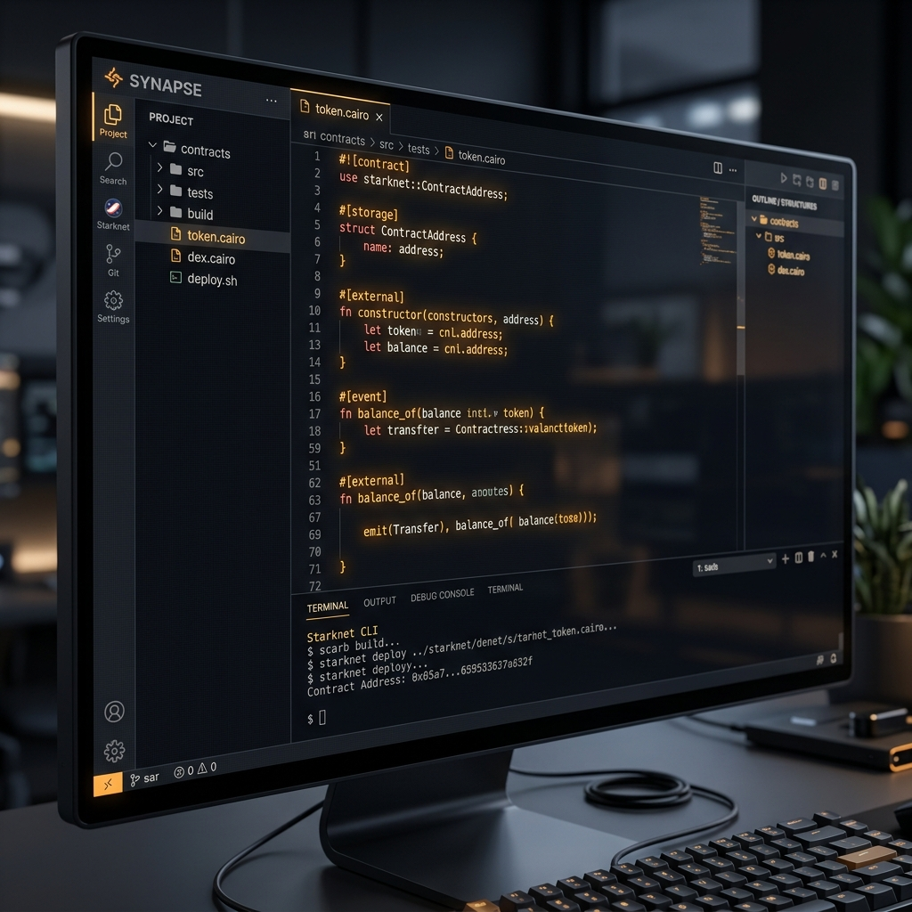

# Unzap Contract Lab

<p align="center">
  
</p>

<p align="center">
  <strong>The Starknet Dev Studio for modern builders.</strong>
</p>

<p align="center">
  Zero-setup IDE, Integrated Cairo Compiler, and Gasless Deployment powered by Starkzap.
</p>

<p align="center">
  
  
  
  
</p>

---

## 🚀 The Vision

Starknet development is powerful, but onboarding is often fragmented. Developers must juggle local environment setups, manual fee management, and complex declaration/deployment flows.

**Unzap Contract Lab** solves this by providing a unified, browser-based studio that removes all local setup friction. Built (from scratch) by a Starknet beginner in just 5 days, it leverages the **Starkzap SDK** to make on-chain interactions feel like "Saved in Cloud."

> [!TIP]
> **No more local compiler issues.** No more Windows vs Linux friction. Write, Build, and Deploy from any machine.

## ✨ Key Features

### 💻 Integrated IDE (Contract Lab)
A high-fidelity development environment built on **CodeMirror 6**.
- **Cairo Syntax Highlighting**: Premium dark theme tailored for Cairo's Rust-like syntax.
- **Real-time Diagnostics**: Visual error and warning squiggles as you type.
- **Keyboard Shortcuts**: `Ctrl+S` to build, `Ctrl+/` to comment, and more.

### 🛠️ Zero-Install Compiler Sidecar
Unzap ships with its own sidecar compiler service (Rust-based).
- **Instant Compilation**: Converts Cairo source code into Sierra and CASM artifacts instantly.
- **No Local Setup**: No need to install Scarb, Rust, or Starknet-compile on your machine.

### ⚡ Gasless Flow (Starkzap SDK)
Deeply integrated with the **Starkzap SDK** and **AVNU Paymaster**.
- **Sponsored Declare**: Studio-sponsored declarations for known templates.
- **Gasless Deployment**: Deploy contracts without holding STRK/ETH (uses sponsored UDC calls).
- **Account Abstraction**: Seamless integration with **Privy** for social login and embedded accounts.

### 📡 Interactive Interaction UI
Auto-generated interface for any deployed contract.
- **Read/Write Panels**: Instantly call any function in your ABI.
- **Execution Terminal**: Real-time logging of transaction hashes and explorer links.

## 🖼️ Previews


*Writing and compiling Cairo in the browser.*


*Interacting with deployed contracts gaslessly.*

## 🛠️ Tech Stack

- **Frontend**: Next.js 16 (App Router), React 19, TypeScript
- **Styling**: Tailwind CSS, Framer Motion, shadcn/ui
- **Blockchain**: Starknet.js v9, **Starkzap SDK v2**
- **Auth**: Privy (Social Login + Embedded Wallets)
- **Database**: Prisma + PostgreSQL (for deployment history and persistence)

## 🏁 Getting Started

### Prerequisites
- Node.js 18+
- Bun (recommended) or npm

### Local Installation
```bash
git clone https://github.com/manovHacksaw/Unzap.git
cd Unzap
bun install
```

### Setup Environment
Create a `.env.local` file:
```env
NEXT_PUBLIC_PRIVY_APP_ID=your_privy_id
NEXT_PUBLIC_AVNU_API_KEY=your_avnu_key
NEXT_PUBLIC_COMPILER_URL=http://localhost:8080
DATABASE_URL=your_db_url
```

### Run the Studio
```bash
bun dev
```
Navigate to `http://localhost:3000/studio/contract-lab`.

## 📜 Documentation Links
- [FEATURES.md](./FEATURES.md) - Deep dive into all capabilities.
- [TECHNICAL_ARCHITECTURE.md](./TECHNICAL_ARCHITECTURE.md) - How it works under the hood.
- [JOURNEY.md](./JOURNEY.md) - The 5-day beginner journey.
- [FUTURE_IMPROVEMENTS.md](./FUTURE_IMPROVEMENTS.md) - Roadmap and visions.

## ⚖️ License
MIT Copyright (c) 2026.
