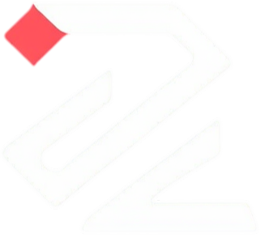
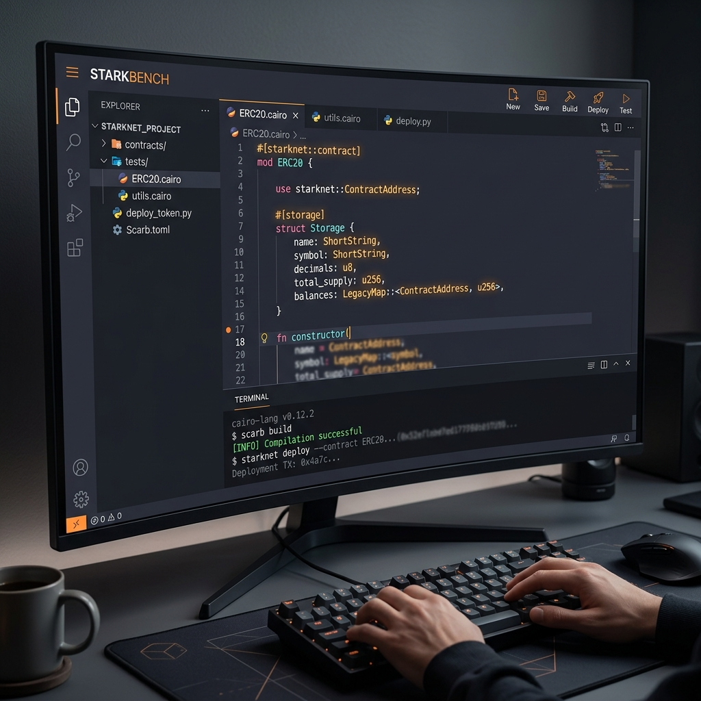

# Unzap

<p align="center">
  
</p>

<p align="center">
  <strong>Starkzap Dev Studio for learning Starknet by doing.</strong>
</p>

<p align="center">
  Guided flows, live execution, contract deployment, and gasless interaction surfaces built on Starkzap.
</p>

<p align="center">
  
  
  
  
  
</p>

<p align="center">
  
</p>

## Overview

Unzap is an interactive Starknet developer studio focused on transparency, education, and execution. Instead of treating SDK workflows like a black box, it exposes the full path from writing Cairo to declaring, deploying, interacting, and observing what happens on-chain.

The product is designed around one core idea:

`Explain -> Execute -> Visualize -> Copy -> Understand`

## Product Surfaces

### Contract Lab

- Write and edit Cairo contracts directly in the browser
- Build, declare, deploy, and interact from a single workspace
- Restore wallet sessions, deployment history, and contract interfaces
- Show execution feedback, gasless flows, and Starknet explorer links inline

### Playground

- Experiment with Starkzap-powered transaction flows
- Explore account abstraction, sponsored transactions, and interaction patterns
- Inspect outputs and behavior in a guided environment

### Guided and Visual Learning

- Break down workflows into understandable steps
- Surface execution states instead of hiding them behind SDK abstractions
- Help new Starknet builders connect concepts to real actions

## Why Unzap

Starknet development is powerful, but onboarding often feels fragmented:

- Cairo authoring is separate from deployment and runtime understanding
- Gasless and account abstraction flows can feel opaque
- Static docs explain APIs, but not the lived execution path

Unzap closes that gap with a product experience that is equal parts dev tool and learning layer.

## Tech Stack

- Next.js 16 App Router
- React 19
- TypeScript
- Tailwind CSS
- Framer Motion
- Starkzap SDK v2
- starknet.js v9
- Privy
- Prisma

## Getting Started

### Prerequisites

- Node.js 18+
- npm or Bun

### Install

```bash
git clone https://github.com/manovHacksaw/Unzap.git
cd Unzap
npm install
```

### Configure environment

Create `.env.local` with the keys your local setup needs. Common ones used by the app include:

```env
NEXT_PUBLIC_PRIVY_APP_ID=
NEXT_PUBLIC_AVNU_API_KEY=
NEXT_PUBLIC_COMPILER_URL=
DATABASE_URL=
```

If you are using the contract build flow locally, make sure your compiler service is available at the URL you provide in `NEXT_PUBLIC_COMPILER_URL`.

### Run the app

```bash
npm run dev
```

Then open:

- `http://localhost:3000/` for the landing page
- `http://localhost:3000/studio` for the studio hub
- `http://localhost:3000/studio/contract-lab` for Contract Lab

### Useful scripts

```bash
npm run dev
npm run build
npm run lint
```

## Repository Notes

- Runtime branding assets live in `app/` and `public/`
- Local-only exports and scratch files are intentionally ignored
- The root repo should stay production-focused and avoid committing developer machine state

## Preview Assets

- `public/previews/contract-lab.png`
- `public/previews/contract-lab-interact.png`

## License

MIT
