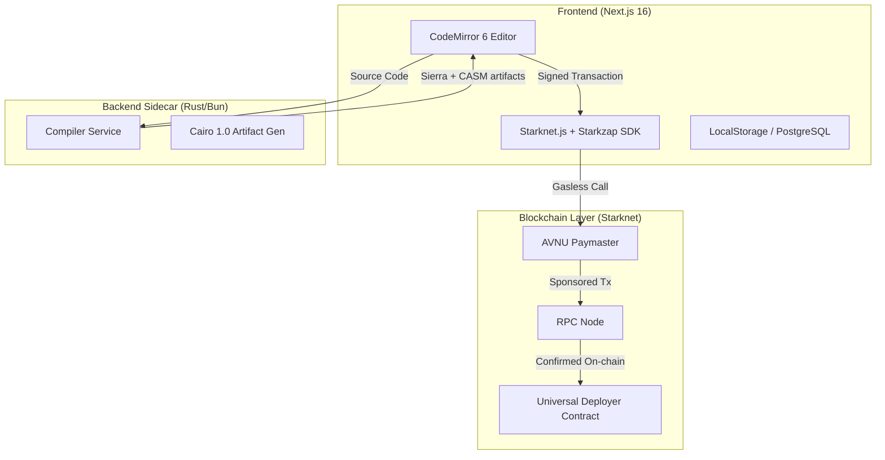

# Technical Architecture

Unzap Contract Lab is built to be a robust, high-performance developer tool. Below is the breakdown of the system architecture, the integration with Starkzap, and the unique challenges of building a browser-based IDE for Starknet.

---

## 🏗️ System Overview

The application follows a modern cloud-native architecture, separating concerns between the frontend UI, the compilation sidecar, and the decentralized blockchain layer.



---

## 💻 Tech Stack Deep Dive

### Frontend Architecture
- **Next.js 16 (App Router)**: Provides optimized server-side rendering for the landing page while allowing high-performance client-side logic for the Studio.
- **React 19**: Leveraging the latest React features for efficient state management and concurrent rendering.
- **CodeMirror 6**: The "heart" of the Studio, chosen for its modularity and high performance when handling large files and complex highlighting rules.

### Storage & Persistence
- **Prisma + PostgreSQL**: Used for storing cross-session deployment history, transaction logs, and user-specific configurations.
- **Client-side Persistence**: The "Contract Lab" implements a robust draft persistence layer in the browser using `localStorage`, ensuring zero data loss during reloads.

---

## 🛠️ The Compilation Flow

Unlike many blockchain development tools, Unzap does not require any local installation. It achieves this through a custom **Compiler Sidecar**.

1.  **Source Extraction**: The IDE extracts the Cairo source code from the active editor buffer.
2.  **Payload Preparation**: The source is packaged and sent to the `CompilerService` via a high-speed HTTP request.
3.  **Real-time Output**: The backend compiler service (running within a Dockerized environment) executes the Cairo compilation steps and streams the stderr/stdout back to the IDE terminal.
4.  **Artifact Delivery**: If successful, the Sierra (JSON) and CASM artifacts are delivered to the frontend for the deployment phase.

---

## ⚡ Starkzap Integration & Gasless Flow

Unzap leans heavily on the **Starkzap SDK** to provide a "Web2-like" feel to blockchain development. 

### 🧬 Sponsored Declaration
The declaration of a contract (uploading its bytecode to Starknet) is traditionally expensive. Unzap implements a "Smart Recovery" flow:
- It first checks if the class hash already exists on-chain.
- If not, it attempts a **Studio-sponsored declare** via our internal backend.
- If sponsorship isn't available, it falls back to a **local wallet declaration**, prompting the user.

### 💨 Gasless Execution (The Secret Sauce)
The Contract Lab uses the `sponsored` fee mode from Starkzap:

```typescript
// Example snippet from Unzap's implementation
const tx = await szWallet.execute([udcCall], { feeMode: "sponsored" });
await tx.wait();
```

By integrating the **AVNU Paymaster**, Unzap allows developers to deploy their contracts to Sepolia without ever needing to worry about bridge fees or faucet usage. This significantly reduces the time-to-first-deployment for new developers.

---

## 🔐 Wallet Abstraction with Privy

Unzap manages user identity through **Privy**, enabling:
1.  **Embedded Wallets**: Creating a persistent Starknet account linked to traditional auth (Google, Discord).
2.  **Signature Persistence**: Maintaining the session state across browser refreshes so the user doesn't have to re-login to check their previous deployments.

---

## 🏗️ Future Technical Goals
- **Browser-native Compilation**: Shifting the sidecar compiler logic into a WASM module to enable 100% offline-first development.
- **Direct IPFS/Arweave integration**: Automatically storing source code references alongside the deployment on-chain.
- **Advanced Debugger**: Integrating the Cairo runtime's tracing output into the visual IDE for real-time debugging.
